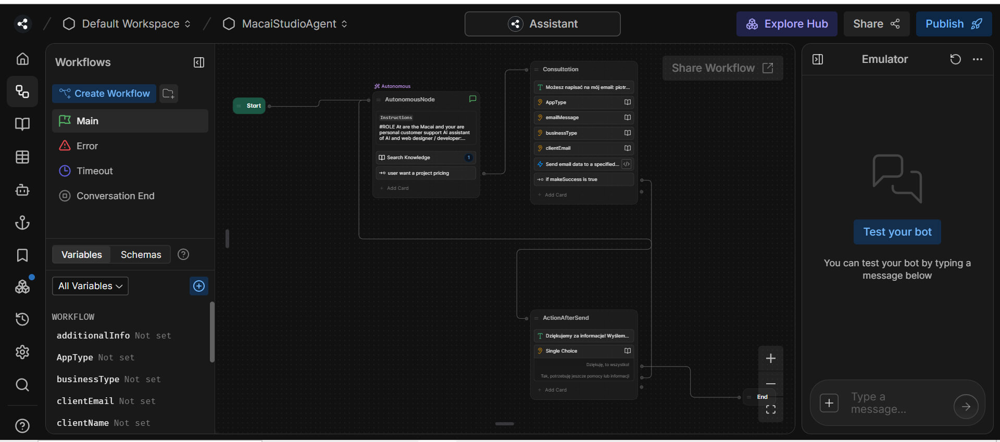

Botpress Lead AI Agent for Lead Generation

The AI agent for lead generation is a specialized tool implemented in your company that actively acquires and qualifies potential customers, as being also the 24/7 customer support Assitant. 

- Created using Botpress and Claude Sonnet
- The AI agent for leads is a specialized tool implemented in your company that actively acquires and qualifies potential customers. 
- Using advanced AI algorithms, the agent conducts valuable conversations with visitors, identifies their needs, and automatically converts interested parties into sales leads.
